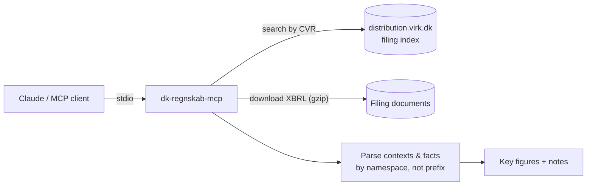

# dk-regnskab-mcp

[](https://github.com/mikkelmanniche-dk/dk-regnskab-mcp/actions/workflows/ci.yml)
[](https://github.com/mikkelmanniche-dk/dk-regnskab-mcp/releases/latest)
[](LICENSE)

Give Claude (or any MCP client) the published annual reports of Danish companies: key figures for the latest year and the year before, read straight from the XBRL filings at the Danish Business Authority (Erhvervsstyrelsen). No API key needed.

Works for small companies (Danish GAAP) and listed ones (IFRS/ESEF, back to 2015), separates group and parent figures in group reports, and explains gaps instead of guessing. Tested live against about 300 real filings.

> "What were revenue and equity for CVR 24256790 last year, and how did they change?"

## Quickstart

Requires Node.js 22.18 or newer.

```bash
git clone https://github.com/mikkelmanniche-dk/dk-regnskab-mcp
cd dk-regnskab-mcp && npm install && npm run build
```

**Claude Code**

```bash
claude mcp add dk-regnskab -- node /absolute/path/to/dk-regnskab-mcp/dist/index.js
```

**Claude Desktop**: add this to `claude_desktop_config.json`:

```json
{
  "mcpServers": {
    "dk-regnskab": { "command": "node", "args": ["/absolute/path/to/dk-regnskab-mcp/dist/index.js"] }
  }
}
```

## Tools

| Tool | Input | Returns |
| --- | --- | --- |
| `get_financials` | `cvr`, optional `year` (the year the reporting period ends in), optional `scope` (`group` or `parent`) | Company name, period, currency, auditor, key figures (current and previous year), whether it is a group report, notes on gaps, source document URL |
| `list_filings` | `cvr`, optional `limit` (1–50) | Published filings, newest first, with document links |

Key figures: revenue, gross profit, operating profit, profit before tax, profit for the year, average employees, total assets, current assets, cash, equity, liabilities.

## How it works



## Pitfalls it handles

Real Danish filings are messier than the taxonomy suggests. The parser was built against actual filings:

- **Dimensional facts are not totals.** A filing reports equity once in total and again per component (share capital, retained earnings). Only dimensionless contexts are used, so share capital is never reported as equity.
- **Conflicting values.** Some filings report two different values for the same fact and period (e.g. 0 and 1 employees). The figure is left empty with a note instead of guessed.
- **Missing revenue is usually legal.** Most small companies (reporting class B) may omit revenue and report gross profit. The result says so.
- **Namespace prefixes vary between filings**, so concepts are matched by namespace URI.
- **Documents are gzip-compressed without saying so.** Detected by magic bytes.
- **The document named "AARSRAPPORT" is not always the one with the numbers.** Every XML document in a filing is parsed, and the one that yields the most figures wins.
- **Group reports hold two sets of figures.** A parent company's report often includes the consolidated group too, and Danish GAAP and IFRS mark them in opposite ways. The group is returned by default; `scope: "parent"` gives the parent alone. Mixing them up can turn a group loss into a parent profit.
- **Balance check.** If total assets don't equal liabilities and equity for the chosen scope, the result says so.
- **Three generations of IFRS.** ESEF (2021 onwards), the Danish IFRS extension before that (revenue as `NetSales`), and the 2011 IFRS taxonomy in filings before 2016. All three are read.
- **Currency comes from the figures themselves.** Maersk reports in USD but mentions DKK elsewhere in the filing.
- **Old reports sit far down the list.** Listed companies publish 4–5 filings a year, so a chosen `year` is filtered in the index, not in the first page of results. Interim reports that carry an annual-report document are skipped.
- **Company details can live in a sibling document**, and some filers put HTML inside the company name. Both are handled.

## Limitations

- **Lookup by CVR number only.** Searching by company name needs the CVR register, which requires an approved account for system-to-system access. Planned.
- Only companies that file machine-readable annual reports. Sole proprietorships and some other company types don't.
- Key figures only, not the full statements, notes or management's review.
- IFRS filings don't tag the number of employees (it is text in the notes), so `employees` is empty for them.
- The filing index answers over plain HTTP only, so the server must run locally or server-side, not in a browser.
- **Data terms:** the filings are public data from the Danish Business Authority. Check their terms of use for your use case; this project does not make claims about them.

## Tested against real filings

`npm run measure` runs the real tool path against about 300 companies that filed in the last year, plus a fixed set of large ones (LEGO, Arla, Carlsberg, Maersk, Novo Nordisk, older IFRS years, and a group report with both scopes). It needs network access and is not part of `npm test`.

Run on 24 September 2026 (v0.2.0): 310 lookups, 308 parsed, 2 companies without an XBRL annual report, 0 errors, 0 balance mismatches, median 133 ms per lookup.

## Development

```bash
npm test          # parser tests against synthetic fixtures (no network)
npm run measure   # live check against real filings (network)
npm run typecheck
npm run build
```

## Roadmap

- [ ] Company name search via the CVR register
- [ ] Multi-year history in one call
- [ ] Publish to npm for `npx` usage

## License

MIT. Built by [Mikkel Manniche](https://mikkelmanniche.dk).
