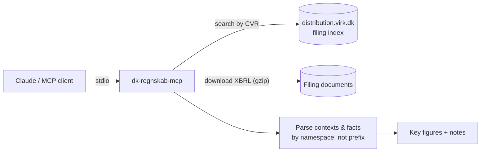

# dk-regnskab-mcp

Give Claude (or any MCP client) the published annual reports of Danish companies: key figures for the latest year and the year before, read straight from the XBRL filings at the Danish Business Authority (Erhvervsstyrelsen). No API key needed.

> "What were revenue and equity for CVR 24256790 last year, and how did they change?"

## Quickstart

Requires Node.js 22.18 or newer.

```bash
git clone https://github.com/mikkelmanniche-dk/dk-regnskab-mcp
cd dk-regnskab-mcp && npm install && npm run build
```

**Claude Code**

```bash
claude mcp add dk-regnskab -- node /absolute/path/to/dk-regnskab-mcp/dist/index.js
```

**Claude Desktop**: add this to `claude_desktop_config.json`:

```json
{
  "mcpServers": {
    "dk-regnskab": { "command": "node", "args": ["/absolute/path/to/dk-regnskab-mcp/dist/index.js"] }
  }
}
```

## Tools

| Tool | Input | Returns |
| --- | --- | --- |
| `get_financials` | `cvr`, optional `year` (the year the reporting period ends in) | Company name, period, currency, auditor, key figures (current and previous year), notes on gaps, source document URL |
| `list_filings` | `cvr`, optional `limit` (1–50) | Published filings, newest first, with document links |

Key figures: revenue, gross profit, operating profit, profit before tax, profit for the year, average employees, total assets, current assets, cash, equity, liabilities.

## How it works



## Pitfalls it handles

Real Danish filings are messier than the taxonomy suggests. The parser was built against actual filings:

- **Dimensional facts are not totals.** A filing reports equity once in total and again per component (share capital, retained earnings). Only dimensionless contexts are used, so share capital is never reported as equity.
- **Conflicting values.** Some filings report two different values for the same fact and period (e.g. 0 and 1 employees). The figure is left empty with a note instead of guessed.
- **Missing revenue is usually legal.** Most small companies (reporting class B) may omit revenue and report gross profit. The result says so.
- **Namespace prefixes vary between filings**, so concepts are matched by namespace URI.
- **Documents are gzip-compressed without saying so.** Detected by magic bytes.
- **The document named "AARSRAPPORT" is not always the one with the numbers.** Every XML document in a filing is parsed, and the one that yields the most figures wins.
- **Two taxonomies.** Danish GAAP for most companies, IFRS (ESEF) for listed ones. Both are supported.

## Limitations

- **Lookup by CVR number only.** Searching by company name needs the CVR register, which requires an approved account for system-to-system access. Planned.
- Only companies that file machine-readable annual reports. Sole proprietorships and some other company types don't.
- Key figures only, not the full statements, notes or management's review.
- Group vs. parent figures in IFRS filings are not yet distinguished beyond ignoring dimensional contexts.
- The filing index answers over plain HTTP only, so the server must run locally or server-side, not in a browser.
- **Data terms:** the filings are public data from the Danish Business Authority. Check their terms of use for your use case; this project does not make claims about them.

## Development

```bash
npm test          # parser tests against synthetic fixtures (no network)
npm run typecheck
npm run build
```

## Roadmap

- [ ] Company name search via the CVR register
- [ ] Group vs. parent figures for IFRS filings
- [ ] Multi-year history in one call
- [ ] Publish to npm for `npx` usage

## License

MIT. Built by [Mikkel Manniche](https://mikkelmanniche.dk).
